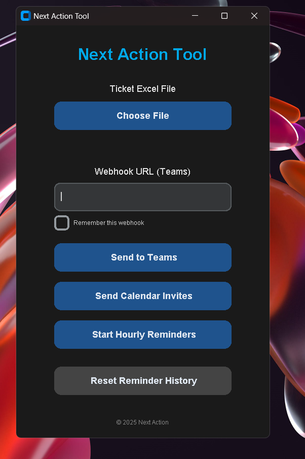

  

  

# Next Action Tool

**Next Action Tool** is a Python-based desktop application designed to streamline IT task tracking and reminders. Built with `customtkinter`, the app integrates Excel, Microsoft Teams, and Outlook to keep agents on track with their ticket responsibilities.

---

## 💡 Key Features

- 📂 **Excel File Support**
  - Selects an `.xlsx` file with ticket data (Number, Assigned To, Due Date, Description)

- 📤 **Send Messages to Microsoft Teams**
  - Push selected ticket data to a Teams channel via incoming webhook

- 📧 **Send Email Invitations**
  - Automatically sends formatted email reminders (including calendar invite details – not as .ics files)

- ⏰ **Hourly Reminder System**
  - Background notifications with optional snooze
  - Keeps agents aware of pending tasks without interrupting their workflow

- 🕹️ **Custom GUI**
  - Modern, user-friendly interface using `customtkinter`

---

## 🚫 What’s Not Included

- ❌ No language selection – English only
- ❌ No `.ics` files – invitations are embedded directly in the email body

---

## 📦 Coming Soon (Planned Features)

- Exercise reminder mode (Pomodoro-style)
- GitHub integration for activity logs
- Light/Dark theme switcher

---

## 💻 Technologies Used

- Python 3.10+
- customtkinter
- openpyxl
- requests
- smtplib / win32com (for Outlook integration)

---

## 🚀 Getting Started

1. Clone the repo or download the `.exe` file (coming soon)
2. Launch the app
3. Choose your Excel file
4. Click to send reminders to Teams or via Email
5. Let the hourly reminders keep you on track!

---

## 📜 License

MIT License

---

> Created with 💪 by Robert – keeping ticket flow smooth and agents on fire 🔥

  

